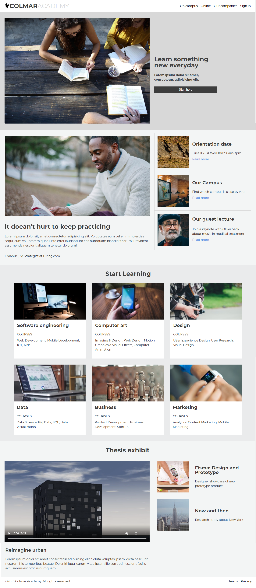

# Codecademy Capstone Project: Colmar Academy

In this project, I am provided with a wireframe, and tasked with designing, and creating the landing page for a new school.

## Table of Contents

- [Licence](#licence)
- [General Info](#general-information)
- [Technologies Used](#technologies-used)
- [Screenshots](#screenshots)
- [Setup](#setup)
- [Project Status](#project-status)
- [Acknowledgements](#acknowledgements)
- [Contact](#contact)

<!-- * [License](#license) -->

## Licence

This project is open source.

## General Information

- This is a Codecademy project written in basic HTML 5, and CSS 3. This is a landing page for a new school.
- Project Objectives:
  - Build a responsive landing page for a new school.
  <!-- You don't have to answer all the questions - just the ones relevant to your project. -->

## Technologies Used

- VSCode - version 1.60.2
- Google Chrome (browser)
- Git and GitHub

## Screenshots

!

## Setup

To navigate to the website use the following link:
<https://christsadi.github.io/Colmar-Academy/>

You will find all the files and the necessary assets for the project which make up this website on this repository.

## Project Status

This project is completed.

## Acknowledgements

- This project was based on <https://www.codecademy.com/paths/learn-how-to-build-websites/tracks/learn-how-to-build-websites-capstone-project/modules/colmar-academy/projects/colmar-academy>.

- Many thanks to codecademy for this exposure.
- Many thanks to... Google & StackOverflow.

## Contact

Created by [@Christ Sadi) - feel free to contact me!
